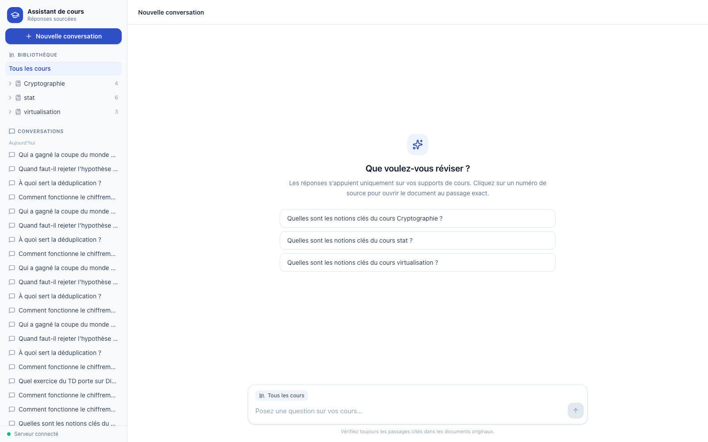
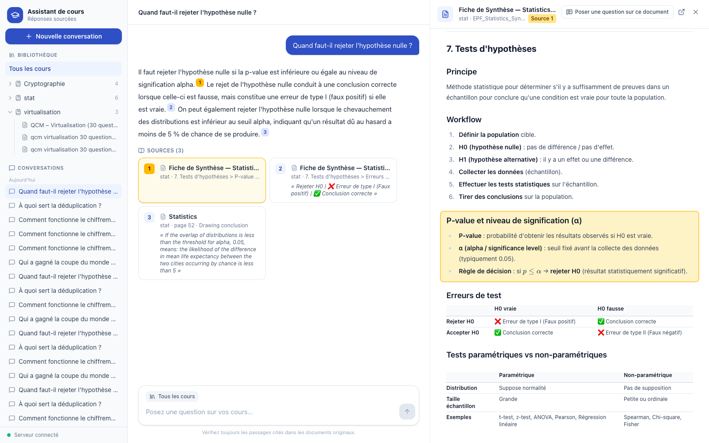

# Assistant de cours — a course RAG with verifiable answers

A question-answering assistant for university courses. Students ask questions in French or English about their course material (lecture slides, exercise sheets, QCMs, summary sheets, spreadsheets) and get answers built **only** from that material. Every sentence of an answer cites its sources, and clicking a citation opens the original document **at the exact lines** the answer relies on.





## What it does

- **Answers from the course only.** Retrieval-augmented generation (RAG): relevant passages are retrieved from the imported courses, and the language model may only use them. If nothing relevant exists, the assistant says so instead of guessing.
- **Verifiable citations.** Each sentence ends with numbered source markers. The model must quote each source word for word; quotes are verified by the server and mapped to their exact position, so the viewer highlights the cited lines on the PDF page, in the Markdown sheet, or in the spreadsheet.
- **Scoped questions.** Ask across all courses, one subject, one course, or a single document (open it from the library and ask about it).
- **Conversations.** Saved automatically, renamed or deleted from the list; follow-up questions ("Et pour AES ?") are understood in context.
- **Real course formats.** Beamer and PowerPoint slides, exercise sheets, QCMs whose answers are highlighted in the PDF, Markdown summaries with LaTeX formulas, Excel workbooks — each parsed with dedicated rules.
- **Runs locally and for free.** The embedding model runs on the user's machine (on the GPU on Apple Silicon); answers are written by Gemini on its free tier, with automatic fallback between models.

## How it works

```text
Import:   course files ─► parse (layout-aware) ─► chunks with their source lines ─► local embeddings ─► PostgreSQL + pgvector
Question: rewrite follow-up ─► embed ─► 8 closest chunks in scope ─► relevance cutoff ─► Gemini (claims + verbatim quotes)
          ─► verify quotes ─► stream the answer ─► citation opens the document with the lines highlighted
```

| Component | Technology | Role |
|---|---|---|
| Embeddings | Qwen3-Embedding-0.6B (sentence-transformers, PyTorch on Apple GPU / CUDA / CPU) | Turns passages and questions into 1024-dimension vectors |
| Vector database | PostgreSQL 16 + pgvector (HNSW index, cosine distance) | Stores documents, chunks, vectors, source positions, conversations |
| API | Python 3.12, FastAPI, SQLAlchemy, Alembic, PyMuPDF | Import, retrieval, answering, conversations, document files |
| Answers | Gemini 3.8 Flash (+ fallbacks) | Writes the answer from the retrieved excerpts |
| Interface | Next.js 15, React 19, Tailwind CSS, react-pdf (pdf.js), KaTeX | French web app: library, chat, document viewer |

**Every design choice — the parsing rules, the chunk size, why this embedding model (benchmarked on the course material), why PostgreSQL rather than a dedicated vector database, the exact LLM prompt and the reason for each instruction, and the measured thresholds — is explained in [docs/ARCHITECTURE.md](docs/ARCHITECTURE.md).**

## Results

Measured on the EPF course material (Cryptographie, Statistiques, Virtualisation — 13 files, 364 chunks) with 30 questions whose answers are known, plus off-topic questions (`python -m app.evaluate`):

| Measure | Result |
|---|---|
| Right passage ranked first | 83 % |
| Right passage among the 3 best | 97 % |
| Right passage among the 8 excerpts given to the model | **100 %** |
| Answerable questions answered | 28 / 30 |
| Off-topic questions refused ("not found") | **5 / 5** |
| Citations whose quote was verified and highlighted exactly | **41 / 41** |
| Time to embed all course material (Apple M4 Pro GPU) | 31 s |

## Quick start

Requirements: [Docker Desktop](https://www.docker.com/products/docker-desktop/), [`uv`](https://docs.astral.sh/uv/) (`brew install uv`), and a [Gemini API key](https://aistudio.google.com/apikey) (free tier).

```sh
cp .env.example .env        # set GEMINI_API_KEY; set DATABASE_PORT=5433 if 5432 is taken
./start.sh                  # embedding model on the GPU, then database, API, and web app in Docker
uv run --project backend python -m app.ingest --all     # import the courses
```

Open <http://localhost:3000>. `./stop.sh` stops everything (data is kept).

The first start installs PyTorch and downloads the embedding model (about 1.2 GB); later starts take seconds. On a machine without a usable GPU or `uv` (for example Windows), `EMBEDDINGS_IN_DOCKER=1 ./start.sh` runs everything in Docker on the CPU (imports are then about 10× slower).

## Adding course material

Put files in the folder named by `PDF_SOURCE_DIR` in `.env` (for example `cours/`), one folder per course, optionally grouped by subject:

```text
cours/                              data/course-pdfs/
  Cryptographie/        (course)      Informatique/         (subject)
    slides.pdf                          Algorithmique/      (course)
    TD/TD1.pdf                            cours_1.pdf
```

Supported: PDF, Markdown, plain text, Excel (`.xlsx`). Export PowerPoint and Word files to PDF. Then:

```sh
uv run --project backend python -m app.ingest --all --dry-run   # preview what will be indexed
uv run --project backend python -m app.ingest --all             # import (unchanged files are skipped)
```

A changed file replaces its previous version; new files are available immediately, without a restart. Scanned PDFs and picture-only slides contain no text and cannot be searched.

## Using the interface

- **Bibliothèque** (left): choose *Tous les cours*, a subject, or a course to limit the search; expand a course and click a document to open it and ask about that document only. The current scope is shown above the question box; `✕` returns to all courses.
- **Answers**: hover a source number to read the quoted passage; click it, or a source card, to open the document at the highlighted lines. *Recherche effectuée* shows how a follow-up question was understood.
- **Conversations**: saved automatically. The address bar keeps the open conversation and document, so a reload or a shared link reopens the same view.

## Repository structure

```text
backend/            FastAPI application (Python)
  app/
    ingest.py         import command (python -m app.ingest)
    ingestion.py      folder discovery, chunking, contextual embedding, storage
    pdf_parsing.py    layout-aware PDF parsing (titles, headers, exponents, overlays, QCMs)
    text_parsing.py   Markdown/text and Excel parsing
    locating.py       maps chunks and quotes to exact source lines
    answering.py      retrieval, prompt, streamed claim validation, citations
    conversations.py  saved conversations
    documents.py      document files and line-numbered views for the viewer
    main.py           HTTP API
    providers/        local embeddings client, Gemini answers, offline test doubles
    evaluate.py       retrieval and answer evaluation
  alembic/          database migrations
  eval/             evaluation questions with their expected sources
  tests/            unit and integration tests
embeddings/         embedding service (runs natively for GPU access, or in Docker)
frontend/           Next.js interface (French)
  components/         library sidebar, chat, document viewer (PDF, text, spreadsheet)
  lib/                API client and chat state
  e2e/                end-to-end check in a real browser
docs/ARCHITECTURE.md  detailed design and the reasoning behind every decision
compose.yaml        database, API, and web services
start.sh / stop.sh  start and stop everything
```

## Configuration

All settings are in `.env` (see `.env.example`). The most useful:

| Setting | Meaning |
|---|---|
| `GEMINI_API_KEY` | Key used to write answers |
| `PDF_SOURCE_DIR` | Folder containing the course material |
| `DATABASE_PORT` | Host port for PostgreSQL (change it if 5432 is used by another PostgreSQL) |
| `ANSWER_MODEL`, `ANSWER_FALLBACK_MODELS` | Gemini models, tried in order when one is overloaded or rate limited |
| `EVIDENCE_MINIMUM_SCORE` | Relevance cutoff (empty: the measured default, 0.40) |
| `RETRIEVAL_LIMIT` | Number of excerpts given to the model (default 8) |

## Quality checks

```sh
uv run --project backend --extra dev pytest backend/tests           # 112 tests
uv run --project backend --extra dev ruff check backend embeddings
uv run --project backend --extra dev mypy backend/app backend/tests
uv run --project backend python -m app.evaluate [--answers]         # retrieval / answer quality
cd frontend && npm test -- --run && npm run lint && npm run typecheck && npm run build   # 24 tests
cd frontend && npm run e2e      # real-browser check of the running app (Chrome, Brave, Edge…)
```

Backend integration tests create and drop a throwaway `course_rag_test` database when PostgreSQL is running (they never touch your data) and are skipped otherwise.

## Limitations

- Images are not read: diagram-only slides contribute only their title, and scanned PDFs need OCR first.
- Excel files are indexed by their text rows (hypotheses, rules, labelled results), not their numerical data.
- There is no authentication: the app is meant for one user on one machine.
- Answer time depends on Gemini's free tier: typically 7–15 s; up to about a minute when a model stalls (after 30 s without a response the next model takes over). When every model is busy, the app asks to retry in a minute.

## Troubleshooting

| Symptom | Fix |
|---|---|
| "Serveur injoignable" in the interface | The API is starting or stopped; the page retries by itself. `docker compose ps` shows service health. |
| Import or answers fail with `EmbeddingServiceError` | Run `./start.sh` (it waits until the model is loaded); see `.run/embeddings.log`. |
| Port 5432 already in use | Another PostgreSQL runs on the machine: set `DATABASE_PORT=5433` in `.env`. |
| "Le service de rédaction des réponses est saturé" | Gemini's free tier is busy; retry after a minute. |
